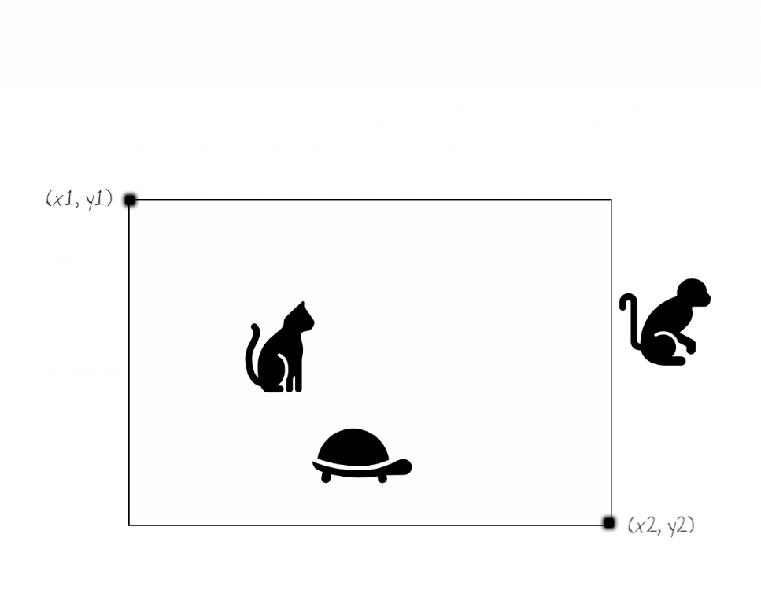

# Doodlerino

Doodlerino is a really big (almost infinite) canvas, where users can pick a random place to draw a doodle. 
Doodles are generated from a mobile app (out of this application scope) and are stored in SVG format in a file server. This application serves as a backend to a mobile app, serving:

- Doodles in a specific canvas section, specified by two coordinates (top-left and bottom-right)
- User profiles
  - Username
  - Email
  - Social media (if any)
  - Doodles by this user

In `app/models/doodle.rb` you will have to implement the `Doodle.bounded_by` method. This method accepts two arguments, the top left corner and the bottom right corner coordinates of a rectangle.

## Your quest

There are 4 failing spec files:

- `spec/models/user_spec.rb`
- `spec/models/doodle_spec.rb`
- `spec/requests/user_doodles_spec.rb`
- `spec/requests/doodles_spec.rb`

Your task is to make them pass. 
